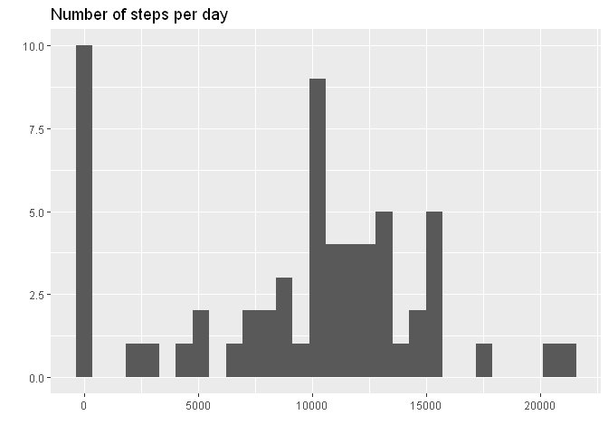
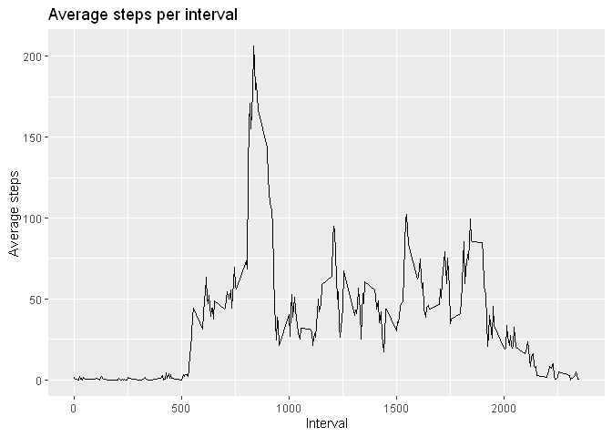
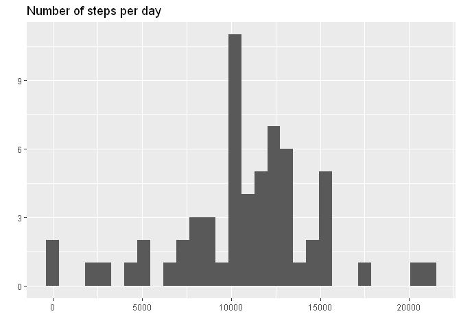
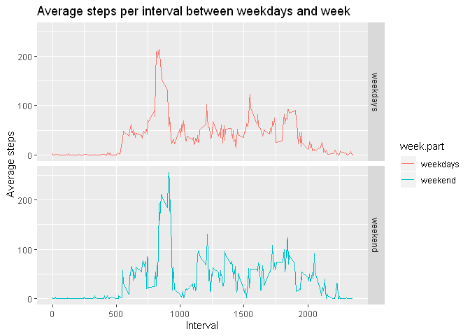

## Activity monitoring (part of Reproducible Research module by Johns Hopkins University)

This assignment was part of the Johns Hopkins Coursera module on [Reproducible Research](https://www.coursera.org/learn/reproducible-research) as part of the [Data Sciene Specialization](https://www.coursera.org/specializations/jhu-data-science).


Full code can be found on [GitHub](https://github.com/bmaingret/RepData_PeerAssessment1).

## Loading and preprocessing the data

The variables included in this dataset are:

* **steps**: Number of steps taking in a 5-minute interval (missing
    values are coded as `NA`)

* **date**: The date on which the measurement was taken in YYYY-MM-DD
    format

* **interval**: Identifier for the 5-minute interval in which
    measurement was taken

The dataset is stored in a comma-separated-value (CSV) file and there
are a total of 17,568 observations in this
dataset.

Loading the data:

```r
if (!file.exists("activity.csv")){
  unzip("activity.zip")
}
data <- read.csv("activity.csv", na.strings = "NA", colClasses = c("integer", "character", "integer"))
data$date <- as.Date(data$date, format="%Y-%m-%d")
```

Checking the data:

```r
str(data)
```

```
## 'data.frame':	17568 obs. of  3 variables:
##  $ steps   : int  NA NA NA NA NA NA NA NA NA NA ...
##  $ date    : Date, format: "2012-10-01" "2012-10-01" ...
##  $ interval: int  0 5 10 15 20 25 30 35 40 45 ...
```

```r
summary(data)
```

```
##      steps             date               interval     
##  Min.   :  0.00   Min.   :2012-10-01   Min.   :   0.0  
##  1st Qu.:  0.00   1st Qu.:2012-10-16   1st Qu.: 588.8  
##  Median :  0.00   Median :2012-10-31   Median :1177.5  
##  Mean   : 37.38   Mean   :2012-10-31   Mean   :1177.5  
##  3rd Qu.: 12.00   3rd Qu.:2012-11-15   3rd Qu.:1766.2  
##  Max.   :806.00   Max.   :2012-11-30   Max.   :2355.0  
##  NA's   :2304
```

```r
head(data)
```

```
##   steps       date interval
## 1    NA 2012-10-01        0
## 2    NA 2012-10-01        5
## 3    NA 2012-10-01       10
## 4    NA 2012-10-01       15
## 5    NA 2012-10-01       20
## 6    NA 2012-10-01       25
```

## What is mean total number of steps taken per day?
*For this part of the assignment, you can ignore the missing values in the dataset.*

Summarizing the data:

```r
total_steps <- data %>% group_by(date) %>%
  summarise(total = sum(steps, na.rm = TRUE))
```

```r
g <- ggplot(total_steps, aes(total))
g <- g + geom_histogram()
g <- g + labs(title="Number of steps per day", y="", x="")
g
```

```
## `stat_bin()` using `bins = 30`. Pick better value with `binwidth`.
```

<!-- -->


```r
mean <- mean(total_steps$total, na.rm = TRUE)
mean
```

```
## [1] 9354.23
```
The mean total number of steps per day is: **9354.23**


```r
median <- median(total_steps$total, na.rm = TRUE)
median
```

```
## [1] 10395
```
The median total number of steps per day is: **10395**

## What is the average daily activity pattern?

Summarizing the data:

```r
steps_interval <- data %>% group_by(interval) %>%
  summarise(mean = mean(steps, na.rm = TRUE))
```


```r
g <- ggplot(steps_interval, aes(interval, mean))
g <- g + geom_line()
g <- g + labs(title="Average steps per interval", y="Average steps", x="Interval")
g
```

<!-- -->


```r
ix <- which.max(steps_interval$mean)
interval <- steps_interval[[ix, "interval"]]
val <- steps_interval[[ix, "mean"]]
```

The interval with max mean number of steps is **835** with a mean number of steps of **206.17**.

```r
h <- floor(interval/60)
m <- interval%%60
```

Supposing the interval starts at 00:00 of each day, this interval corresponds to **13:55**.

## Imputing missing values

Total number of missing values:

```r
apply(is.na(data), 2, sum)
```

```
##    steps     date interval 
##     2304        0        0
```

We will fill in the missing steps values with the mean for the specific day and interval.

First we compute the mean for each interval and day of the week.

```r
data <- data %>% mutate(weekday = as.factor(as.POSIXlt(date)$wday))
fill_val <- data %>% group_by(weekday, interval) %>%
  summarise(mean = mean(steps, na.rm = TRUE))
```

Imputing missing data.

```r
data_nna <- data

for (row in 1:nrow(data_nna)) {
  if(is.na(data_nna[row, "steps"])) {
    wd <- data_nna[row, "weekday"]
    interval <- data[row, "interval"]
    data_nna[row, "steps"] <- fill_val[fill_val$weekday==wd & fill_val$interval==interval, "mean"]
  }
}

apply(is.na(data_nna), 2, sum)
```

```
##    steps     date interval  weekday 
##        0        0        0        0
```

Repeating first steps of the assignement now with the imputed data.
Summarizing the data:

```r
total_steps_nna <- data_nna %>% group_by(date) %>%
  summarise(total = sum(steps))
```

```r
g <- ggplot(total_steps_nna, aes(total))
g <- g + geom_histogram()
g <- g + labs(title="Number of steps per day", y="", x="")
g
```

```
## `stat_bin()` using `bins = 30`. Pick better value with `binwidth`.
```

<!-- -->


```r
mean_nna <- mean(total_steps_nna$total)
mean_nna
```

```
## [1] 10821.21
```
The mean total number of steps per day is: **10821.21** (was 9354.23 before imputation).


```r
median_nna <- median(total_steps_nna$total)
median_nna
```

```
## [1] 11015
```
The median total number of steps per day is: **11015.00** (was 10395 before imputation).

## Are there differences in activity patterns between weekdays and weekends?

Summarizing the data:

```r
steps_interval_nna <- data_nna %>% mutate(week.part = if_else(weekday %in% c(1,6), "weekend", "weekdays")) %>%
  group_by(week.part,interval) %>%
  summarise(mean = mean(steps, na.rm = TRUE))
```


```r
g <- ggplot(steps_interval_nna, aes(interval, mean, col=week.part))
g <- g + geom_line()
g <- g + facet_grid(rows = vars(week.part))
g <- g + labs(title="Average steps per interval between weekdays and week", y="Average steps", x="Interval")
g
```

<!-- -->

