Motor Trend Car Road Tests (mtcars) datasets - Analysis and Regression
================
Baptiste Maingret
08/11/2019

## Motor Trend Car Road Tests (mtcars) datasets - Analysis and Regression

This assignment was part of the Johns Hopkins Coursera module on
[Regression Models](https://www.coursera.org/learn/regression-models) as
part of the [Data Sciene
Specialization](https://www.coursera.org/specializations/jhu-data-science).

<!--more-->

Source code available on
[GitHub](https://github.com/bmaingret/regression-models-project)

## Summary

We want to answer these two questions:

  - Is an automatic or manual transmission better for MPG?
  - Quantify the MPG difference between automatic and manual
    transmissions?

We compared the mean mpg for automatic and manual transmission and
concluded the difference in favor of manual tranmission in terms of mpg
was significant. We then looked further to check other variables to
explain the difference in mpg.

## Look at the data

Glimpse at the data.

    ##    mpg cyl disp  hp drat    wt  qsec       vs     am gear carb mean.mpg
    ## 1 21.0   6  160 110 3.90 2.620 16.46 v.shaped manual    4    4 20.09062
    ## 2 21.0   6  160 110 3.90 2.875 17.02 v.shaped manual    4    4 20.09062
    ## 3 22.8   4  108  93 3.85 2.320 18.61 straight manual    4    1 20.09062

    ##       mpg             cyl             disp             hp       
    ##  Min.   :10.40   Min.   :4.000   Min.   : 71.1   Min.   : 52.0  
    ##  1st Qu.:15.43   1st Qu.:4.000   1st Qu.:120.8   1st Qu.: 96.5  
    ##  Median :19.20   Median :6.000   Median :196.3   Median :123.0  
    ##  Mean   :20.09   Mean   :6.188   Mean   :230.7   Mean   :146.7  
    ##  3rd Qu.:22.80   3rd Qu.:8.000   3rd Qu.:326.0   3rd Qu.:180.0  
    ##  Max.   :33.90   Max.   :8.000   Max.   :472.0   Max.   :335.0  
    ##       drat             wt             qsec              vs    
    ##  Min.   :2.760   Min.   :1.513   Min.   :14.50   v.shaped:18  
    ##  1st Qu.:3.080   1st Qu.:2.581   1st Qu.:16.89   straight:14  
    ##  Median :3.695   Median :3.325   Median :17.71                
    ##  Mean   :3.597   Mean   :3.217   Mean   :17.85                
    ##  3rd Qu.:3.920   3rd Qu.:3.610   3rd Qu.:18.90                
    ##  Max.   :4.930   Max.   :5.424   Max.   :22.90                
    ##          am          gear            carb      
    ##  automatic:19   Min.   :3.000   Min.   :1.000  
    ##  manual   :13   1st Qu.:3.000   1st Qu.:2.000  
    ##                 Median :4.000   Median :2.000  
    ##                 Mean   :3.688   Mean   :2.812  
    ##                 3rd Qu.:4.000   3rd Qu.:4.000  
    ##                 Max.   :5.000   Max.   :8.000

## MPG difference between automatic and manual transmission

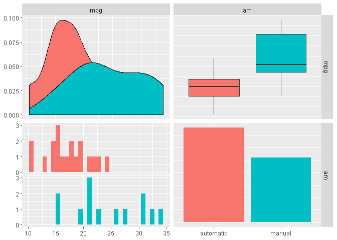<!-- -->

Looking at the boxplot we see a difference between the two transmission
type’s mpg.

We check normality, variance equality to see how we can conduct our test
(details in appendix), and then conducted a two-sided T-Test:

``` r
mpg.test <- t.test(auto, manual, alternative="two.sided", paired=FALSE, var.equal = FALSE)
```

We have a p-value of 0.14% \< 5%, and a confidence interval \[-11 ;
-3.2\] for the difference of mean mpg between automatic and manual
excluding 0.

From the look of this manual transmission allows for more mpg with 0
more mpg in average.

If we fit a simple linear model to our data we end up with similar
results as previously (increased of roughly 7.2 mpg), and we can have a
look at the residual plot, which are alost normal (graphically speaking)
for automatic but not as much for manual. Looking at the reisudals
against several other possible predictors, we can see some linear trends
(e.g. hp and wt).

## Going further

Looking at pairplot and correlation plot we see that other variables
since more correlated with mpg than am.

``` r
ggpairs(mtcars, aes(colour = am), columns = seq(1,11,1),
        progress=FALSE, upper = list(continuous = wrap("cor", size = 3)))
```

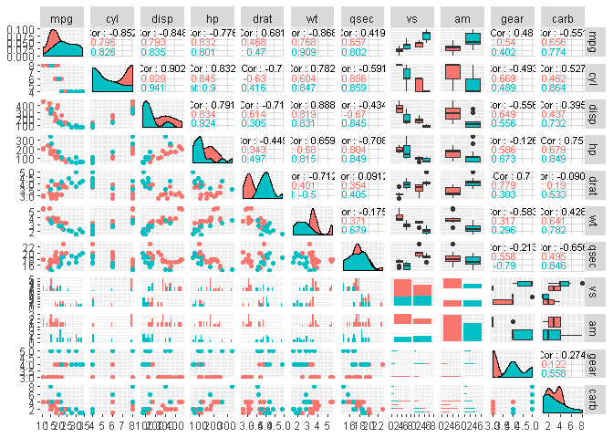<!-- -->

``` r
mtcars.cor <- cor(mtcars %>% mutate(am=as.numeric(am), vs=as.numeric(vs)) %>% select(-c(mean.mpg)))
corrplot(mtcars.cor, type = "upper", order = "hclust", tl.col = "black", tl.srt = 45)
```

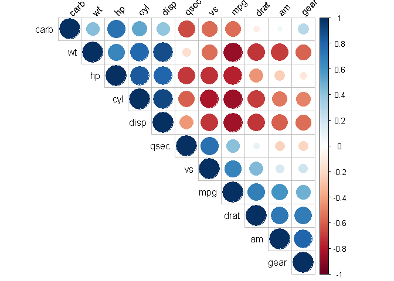<!-- -->

### Adding variables to our model

We can try to add wt, cyl and disp wich seems to be relevant candidates
both from mechanical point of view and from the corrplot.

``` r
rownames(mtcars) <- rownames(datasets::mtcars)
fit2<-lm(mpg~I(hp/10)+wt+cyl+disp+am,mtcars)
summary(fit2)
```

    ## 
    ## Call:
    ## lm(formula = mpg ~ I(hp/10) + wt + cyl + disp + am, data = mtcars)
    ## 
    ## Residuals:
    ##     Min      1Q  Median      3Q     Max 
    ## -3.5952 -1.5864 -0.7157  1.2821  5.5725 
    ## 
    ## Coefficients:
    ##             Estimate Std. Error t value Pr(>|t|)    
    ## (Intercept) 38.20280    3.66910  10.412 9.08e-11 ***
    ## I(hp/10)    -0.27960    0.13922  -2.008  0.05510 .  
    ## wt          -3.30262    1.13364  -2.913  0.00726 ** 
    ## cyl         -1.10638    0.67636  -1.636  0.11393    
    ## disp         0.01226    0.01171   1.047  0.30472    
    ## ammanual     1.55649    1.44054   1.080  0.28984    
    ## ---
    ## Signif. codes:  0 '***' 0.001 '**' 0.01 '*' 0.05 '.' 0.1 ' ' 1
    ## 
    ## Residual standard error: 2.505 on 26 degrees of freedom
    ## Multiple R-squared:  0.8551, Adjusted R-squared:  0.8273 
    ## F-statistic:  30.7 on 5 and 26 DF,  p-value: 4.029e-10

Only weight, hp and tranmission type seems significant.

### Modelling withough transmission type

``` r
fit3<-lm(mpg~I(hp/10)+wt+cyl+disp,mtcars)
summary(fit3)
```

    ## 
    ## Call:
    ## lm(formula = mpg ~ I(hp/10) + wt + cyl + disp, data = mtcars)
    ## 
    ## Residuals:
    ##     Min      1Q  Median      3Q     Max 
    ## -4.0562 -1.4636 -0.4281  1.2854  5.8269 
    ## 
    ## Coefficients:
    ##             Estimate Std. Error t value Pr(>|t|)    
    ## (Intercept) 40.82854    2.75747  14.807 1.76e-14 ***
    ## I(hp/10)    -0.20538    0.12147  -1.691 0.102379    
    ## wt          -3.85390    1.01547  -3.795 0.000759 ***
    ## cyl         -1.29332    0.65588  -1.972 0.058947 .  
    ## disp         0.01160    0.01173   0.989 0.331386    
    ## ---
    ## Signif. codes:  0 '***' 0.001 '**' 0.01 '*' 0.05 '.' 0.1 ' ' 1
    ## 
    ## Residual standard error: 2.513 on 27 degrees of freedom
    ## Multiple R-squared:  0.8486, Adjusted R-squared:  0.8262 
    ## F-statistic: 37.84 on 4 and 27 DF,  p-value: 1.061e-10

``` r
anova(fit2,fit3)
```

    ## Analysis of Variance Table
    ## 
    ## Model 1: mpg ~ I(hp/10) + wt + cyl + disp + am
    ## Model 2: mpg ~ I(hp/10) + wt + cyl + disp
    ##   Res.Df    RSS Df Sum of Sq      F Pr(>F)
    ## 1     26 163.12                           
    ## 2     27 170.44 -1   -7.3245 1.1675 0.2898

We see we have similar R-square, RSS and p-value while droping the
transmission type.

### Automatic model selection

Let’s try some automatic model selection to see what we could get.

``` r
library(MASS)
```

    ## 
    ## Attaching package: 'MASS'

    ## The following object is masked from 'package:dplyr':
    ## 
    ##     select

``` r
# Fit the full model 
full.model <- lm(mpg ~., data = datasets::mtcars)
# Stepwise regression model
step.model <- stepAIC(full.model, direction = "both", 
                      trace = FALSE)
summary(step.model)
```

    ## 
    ## Call:
    ## lm(formula = mpg ~ wt + qsec + am, data = datasets::mtcars)
    ## 
    ## Residuals:
    ##     Min      1Q  Median      3Q     Max 
    ## -3.4811 -1.5555 -0.7257  1.4110  4.6610 
    ## 
    ## Coefficients:
    ##             Estimate Std. Error t value Pr(>|t|)    
    ## (Intercept)   9.6178     6.9596   1.382 0.177915    
    ## wt           -3.9165     0.7112  -5.507 6.95e-06 ***
    ## qsec          1.2259     0.2887   4.247 0.000216 ***
    ## am            2.9358     1.4109   2.081 0.046716 *  
    ## ---
    ## Signif. codes:  0 '***' 0.001 '**' 0.01 '*' 0.05 '.' 0.1 ' ' 1
    ## 
    ## Residual standard error: 2.459 on 28 degrees of freedom
    ## Multiple R-squared:  0.8497, Adjusted R-squared:  0.8336 
    ## F-statistic: 52.75 on 3 and 28 DF,  p-value: 1.21e-11

We find again wt and am which confort us in our previous models. We also
have an additional variable that we did not explore before: qsec.

We can however argue that qsec is strongly correlated with horsepower
(and cylinder, displacement, etc.)

### Some PCA

``` r
library("FactoMineR")
library("factoextra")
```

    ## Welcome! Related Books: `Practical Guide To Cluster Analysis in R` at https://goo.gl/13EFCZ

``` r
res.pca <- PCA(datasets::mtcars, scale.unit = TRUE, ncp = 5, graph = FALSE)


fviz_pca_var(res.pca, col.var = "cos2", repel = TRUE)
```

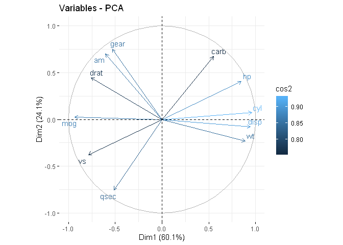<!-- -->

``` r
fviz_eig(res.pca, addlabels = TRUE, ylim = c(0, 50))
```

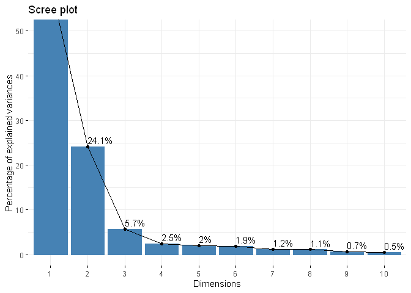<!-- -->

``` r
fviz_contrib(res.pca, choice = "var", axes = 1, top = 10)
```

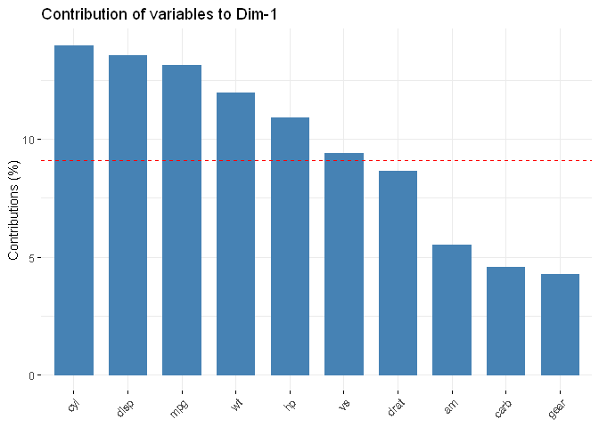<!-- -->

``` r
fviz_contrib(res.pca, choice = "var", axes = 2, top = 10)
```

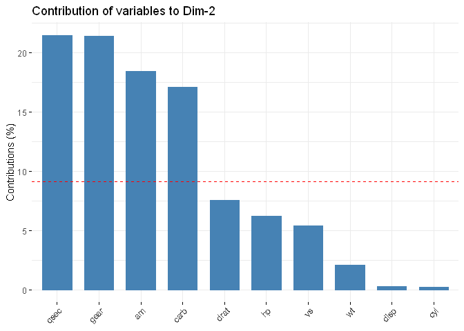<!-- -->

## Normality and variance

### Normality of data

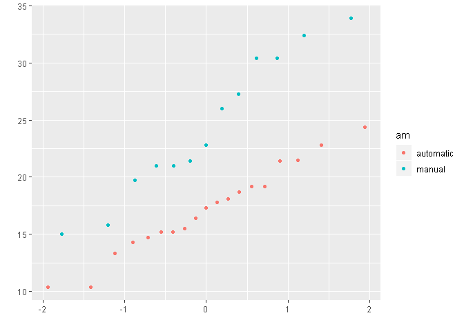<!-- -->

``` r
shapiro.test(manual)
```

    ## 
    ##  Shapiro-Wilk normality test
    ## 
    ## data:  manual
    ## W = 0.9458, p-value = 0.5363

``` r
shapiro.test(auto)
```

    ## 
    ##  Shapiro-Wilk normality test
    ## 
    ## data:  auto
    ## W = 0.97677, p-value = 0.8987

### Comparison of variance

``` r
var.test(auto, manual)
```

    ## 
    ##  F test to compare two variances
    ## 
    ## data:  auto and manual
    ## F = 0.38656, num df = 18, denom df = 12, p-value = 0.06691
    ## alternative hypothesis: true ratio of variances is not equal to 1
    ## 95 percent confidence interval:
    ##  0.1243721 1.0703429
    ## sample estimates:
    ## ratio of variances 
    ##          0.3865615

### T-Test

``` r
mpg.test <- t.test(auto, manual, alternative="two.sided", paired=FALSE, var.equal = FALSE)
mpg.test
```

    ## 
    ##  Welch Two Sample t-test
    ## 
    ## data:  auto and manual
    ## t = -3.7671, df = 18.332, p-value = 0.001374
    ## alternative hypothesis: true difference in means is not equal to 0
    ## 95 percent confidence interval:
    ##  -11.280194  -3.209684
    ## sample estimates:
    ## mean of x mean of y 
    ##  17.14737  24.39231

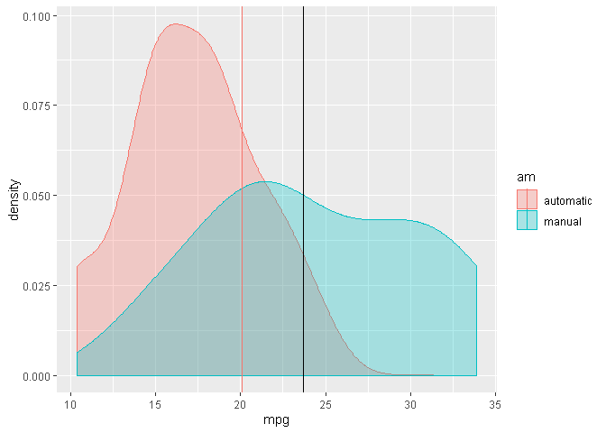<!-- -->

### Residual plots

``` r
fit<-lm(mpg ~ am, mtcars)
qplot(residuals(fit), color=mtcars$am, geom = 'density')
```

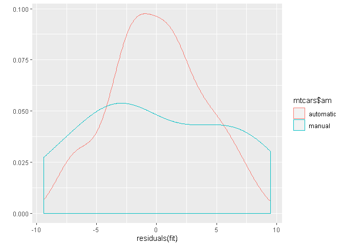<!-- -->

``` r
mtcars$mpg.resid <- residuals(fit)
mtcars.gathered <- mtcars %>% dplyr::select(am, mpg.resid, cyl, disp, hp, wt, qsec) %>% mutate_if(is.numeric, scale) %>% gather(key, value, -c(am,mpg.resid))
ggplot(mtcars.gathered, aes(x = mpg.resid, y = value, color=am)) +
  geom_point() +
  facet_grid(. ~ key) 
```

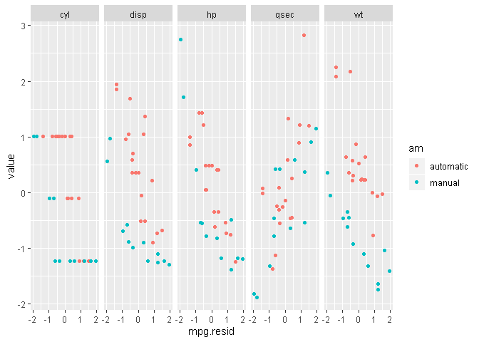<!-- -->
