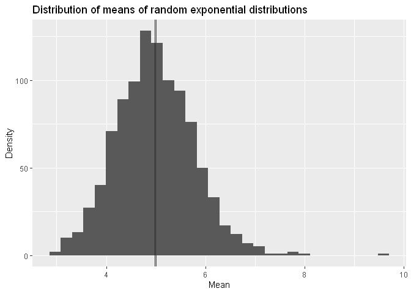
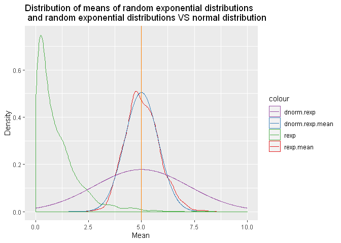

Simulation around the Exponential Distribution
================
Baptiste Maingret

## Simulation around the Exponential Distribution (part of Statistical Inference by Johns Hopkins University)

This assignment was part of the Johns Hopkins Coursera module on
[Statistical
Inference](https://www.coursera.org/learn/statistical-inference) as part
of the [Data Science
Specialization](https://www.coursera.org/specializations/jhu-data-science).

<!--more-->

Source code available on
[GitHub](https://github.com/bmaingret/eda-storm-data)

## Overview

The goal is to illustrate via simulation some properties of the
distribution of the mean of exponential distributions and its link to
the Central Limit Theorem.

## Simulations

The theoritical values comes from the definition of an exponential
distribution and from the CLT.

1.  We draw 40 random samples from an exponential distribution with the
    defined \(\lambda\) parameter and we repeat this process 1000 times.
2.  we compute the mean for each draw
3.  We compute the mean and variance of the distribution of the means
    computed in 2.

<!-- end list -->

``` r
library(ggplot2)
library(datasets)
library(RColorBrewer)

lambda <- 0.2
n.exp <- 40
n.sim <- 1000

theory.mean <- 1/lambda
theory.var <- 1/lambda
theory.mean.mean <- 1/lambda # from CLT
theory.mean.var <- 1/(lambda^2*n.exp) # from CLT

exp.sim <- matrix(rexp(n.exp * n.sim, lambda), n.sim, n.exp)
exp.mean <- apply(exp.sim, MARGIN = 1, mean)
exp.mean.mean <- mean(exp.mean)
exp.mean.var <- var(exp.mean)
```

## Sample mean versus theory

Let’s plot the distribution of means and both the experimental and
theoritical mean for this \(\lambda\) parameterized exponential
distribution.

``` r
qplot(exp.mean) + geom_vline(xintercept=theory.mean.mean, color="red") +
    geom_vline(xintercept=exp.mean.mean, color="blue") +
    labs(title="Distribution of means of random exponential distributions", y="Density", x="Mean")
```

<!-- -->

From the CLT, the theoritical mean is \(\frac{1}{\lambda}=5\),
represented by the **red** line on the graph above.

The empirical mean is *4.9856209*, represented by the **blue** line on
the graph above, which is very close to the theoritical mean.

## Sample mean variance versus theory

We can have a look at the variance of the means.

From the CLT, the theoritical var is \(\frac{1}{\lambda^2*n}=0.625\),
represented by the **red** line on the graph above.

The empirical var is *0.6099441*, represented by the **blue** line on
the graph above, which is very close to the theoritical var

## Distribution: is it normal?

Theory says that the means of iid random variables distributed along the
same distribution law should follow a standard normal distribution (for
n large).

We will plot both the distribution of the mean and a normal
distribution, as well as a distribution of random exponential
distribution and a normal distribution.

``` r
x.dnorm <- seq(0,10,length.out = 1000)
y.dnorm.mean <- dnorm(x.dnorm, mean=theory.mean.mean,sd=sqrt(theory.mean.var))
y.dnorm <- dnorm(x.dnorm, mean=theory.mean,sd=sqrt(theory.var))
r.rexp <- rexp(1000)
p.col <- brewer.pal(5, "Set1")

data <- data.frame(rand.exp.mean.distribution = exp.mean, rand.exp.distribution = r.rexp, x.dnorm, normal.distribution.rand.exp = y.dnorm, normal.distribution.rand.exp.mean = y.dnorm.mean)
g <- ggplot(data) 
g <- g + labs(title="Distribution of means of random exponential distributions \n and random exponential distributions VS normal distribution", y="Density", x="Mean")
g <- g + geom_density(aes(exp.mean, colour="rexp.mean"))
g <- g + geom_line(aes(x.dnorm,y.dnorm.mean, colour="dnorm.rexp.mean"))
g <- g + geom_density(aes(r.rexp, colour="rexp"))
g <- g + geom_line(aes(x.dnorm,y.dnorm, colour="dnorm.rexp"))
g <- g + geom_vline(xintercept=theory.mean.mean, colour=p.col[5])
g <- g + scale_color_manual(values = c(rexp.mean = p.col[1], dnorm.rexp.mean=p.col[2],rexp=p.col[3], dnorm.rexp=p.col[4]))
g
```

<!-- -->
We see that the two are similar which is to be expected from the CLT. In
comparison, the distribution of random exponential distribution is
different from a normal distribution with similar mean and variance.
