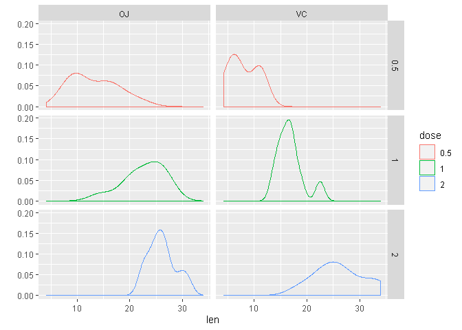

Effect of Vitamin C on Tooth Growth in Guinea Pigs
================
Baptiste Maingret

## Basic Inferential Data Analysis on ToothGrowth dataset (part of Statistical Inference by Johns Hopkins University)

This assignment was part of the Johns Hopkins Coursera module on
[Statistical
Inference](https://www.coursera.org/learn/statistical-inference) as part
of the [Data Science
Specialization](https://www.coursera.org/specializations/jhu-data-science).

<!--more-->

Source code available on
[GitHub](https://github.com/bmaingret/stat-inference-project)

## Overview

The goal is to conduct some simple hypothesis testing on the ToothGrowth
dataset available in the R datasets package.

Some assumptions:

  - equal variances among groups
  - standard deviation estimated from the samples
  - \(\alpha\) is set to 5%
  - samples are not paired

## Data processing

We import the data and directly set the *dose* as a factor.

``` r
library(ggplot2)
library(datasets)
tg <- datasets::ToothGrowth
tg$dose <- as.factor(tg$dose)
```

Glimpse at data.

``` r
str(tg)
```

    ## 'data.frame':    60 obs. of  3 variables:
    ##  $ len : num  4.2 11.5 7.3 5.8 6.4 10 11.2 11.2 5.2 7 ...
    ##  $ supp: Factor w/ 2 levels "OJ","VC": 2 2 2 2 2 2 2 2 2 2 ...
    ##  $ dose: Factor w/ 3 levels "0.5","1","2": 1 1 1 1 1 1 1 1 1 1 ...

``` r
summary(tg)
```

    ##       len        supp     dose   
    ##  Min.   : 4.20   OJ:30   0.5:20  
    ##  1st Qu.:13.07   VC:30   1  :20  
    ##  Median :19.25           2  :20  
    ##  Mean   :18.81                   
    ##  3rd Qu.:25.27                   
    ##  Max.   :33.90

Some plots.

``` r
  qplot(x=len, data=tg, color=dose, group = dose, geom = "density", facets = dose ~ supp)
```

<!-- -->

### Has the delivery method an impact on tooth growth?

We will test in regards of the null-hypothesis that their is no
difference in means between the two groups.

``` r
n = 10
x = tg[tg$supp=="OJ", "len"]
y = tg[tg$supp=="VC", "len"]
delta = mean(x) - mean(y)
p.sd = sqrt((var(x)+var(y))/2)

t.res <- t.test(x, y, alternative = "two.sided", mu = 0, paired = FALSE, var.equal = TRUE)
p.res <- power.t.test(n, delta, p.sd, sig.level=0.05, type="two.sample", alternative="two.sided")
```

We have a p-value (6.0393371%) larger the 5% and in addition the
confidence interval (-0.1670064, 7.5670064) covers the value 0. We fail
to reject the null hypothesis in this case.

### Has the dose an impact on tooth growth?

We test the difference in means between each dosage (3 tests: 0.05 vs 1,
0.5 vs 2, 1 vs 2).

``` r
n = 10
x = tg[tg$dose=="0.5", "len"]
y = tg[tg$dose=="1", "len"]
delta = mean(x) - mean(y)
p.sd = sqrt((var(x)+var(y))/2)

t.res.a <- t.test(x, y, alternative = "two.sided", mu = 0, paired = FALSE, var.equal = TRUE)
p.res.a <- power.t.test(n, delta, p.sd, sig.level=0.05, type="two.sample", alternative="two.sided")
```

``` r
n = 10
x = tg[tg$dose=="0.5", "len"]
y = tg[tg$dose=="2", "len"]
delta = mean(x) - mean(y)
p.sd = sqrt((var(x)+var(y))/2)

t.res.b <- t.test(x, y, alternative = "two.sided", mu = 0, paired = FALSE, var.equal = TRUE)
p.res.b <- power.t.test(n, delta, p.sd, sig.level=0.05, type="two.sample", alternative="two.sided")
```

``` r
n = 10
x = tg[tg$dose=="1", "len"]
y = tg[tg$dose=="2", "len"]
delta = mean(x) - mean(y)
p.sd = sqrt((var(x)+var(y))/2)

t.res.c <- t.test(x, y, alternative = "two.sided", mu = 0, paired = FALSE, var.equal = TRUE)
p.res.c <- power.t.test(n, delta, p.sd, sig.level=0.05, type="two.sample", alternative="two.sided")
```

    ##                      dose.0.5v1    dose.0.5v2      dose.1v2
    ## p-value            1.266297e-07  2.837553e-14  1.810829e-05
    ## conf-interval-low -1.198375e+01 -1.815352e+01 -8.994387e+00
    ## conf-interval-up  -6.276252e+00 -1.283648e+01 -3.735613e+00
    ## power              9.909607e-01  1.000000e+00  9.057799e-01

## Conclusions

We failed to reject the null-hypothesis regarding the impact of the
delivery method on tooth growth.

The dosage was found to be statistically significant and tests rejected
the null-hypothesis.
